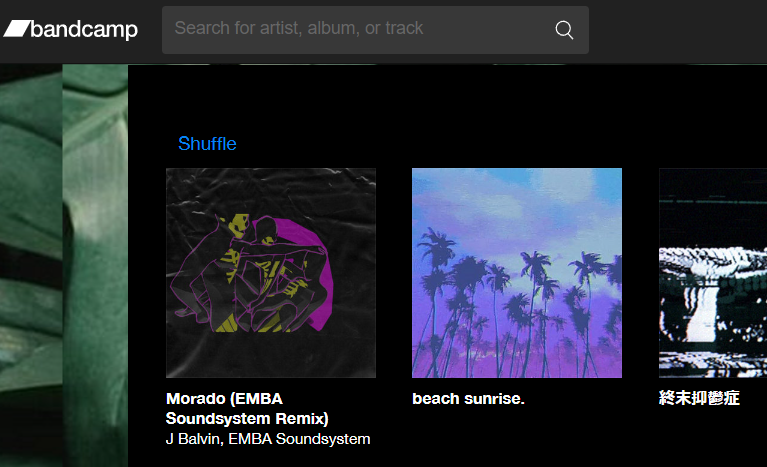

# Bandcamp Albums Randomiser
Adds a Shuffle button to Bandcamp Albums page to randomly enter an album.

# How to Install
1. Download a release
2. Unzip the release
3. In Chrome's [extension settings](chrome://extensions/), choose "Load unpacked".
4. Select the extension folder extracted from the zip.

# See Also
[BShuffle](https://github.com/risonakamo/bshuffle) is extension for random play songs while in a single album.

# Developer Notes
How to build

1. `pnpm i`
2. `pnpm build` or `pnpm watch`

# Generating Release
1. Choose version for manifest and package jsons
2. Update `version.md` with description
3. Update `gen-release.sh` config section
4. Run `gen-release`
5. Zip the created release
6. Git commit, tag, push
7. Create release and upload zip